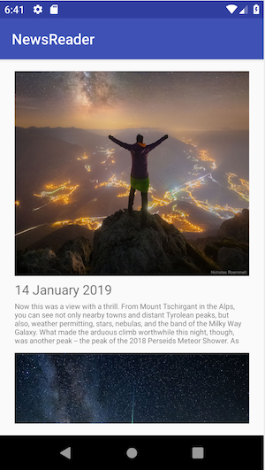

Le but de ce TP est de vous sensibiliser et de vous familiariser avec certaines notions de sécurité informatique.
Les pratiques que vous allez mettre en oeuvre ne sont autorisées que sur du matériel vous appartenant ou pour lequel
vous avez les autorisations écrites nécessaires émanant des autorités idoines.

**Article 323-1 du code pénal, Modifiée par LOI 2012-410 du 27 mars 2012 - art. 9}**

Le fait d'accéder ou de se maintenir, frauduleusement, dans tout ou partie d'un système de traitement automatisé de données est puni de deux ans d'emprisonnement et de 30000 euros d'amende.

Lorsqu'il en est résulte soit la suppression ou la modification de données contenues dans le système, soit une altération du fonctionnement de ce système, la peine est de trois ans d'emprisonnement et de 45000 euros d'amende.

Lorsque les infractions prévues aux deux premiers alinéas ont été commises à l'encontre d'un système de traitement automatisée de données à caractère personnel mis en oeuvre par l'Etat, la peine est portée à cinq ans d'emprisonnement et à 75 000 euros d'amende.


## Contexte

Pour cacher leurs comportements malicieux, les malwares ont souvent recourt à la technique dite d'`application collusion`.
Cette technique consiste à faire collaborer deux applications ou plus dans le but d'accomplir des actions malicieuses
qu'elles ne pourraient pas faire indépendamment.

Dans ce TP, il vous est demandé de mettre en oeuvre une attaque par *application collusion* sur un téléphone.


## Partie I: Traquer la position GPS

Dans cette partie, vous devez concevoir une application Android qui relève la position GPS du téléphone toutes les 
minutes.
Pour légitimer la demande de permission induite et ne pas alerter l'utilisateur,
l'application devra imiter le comportement d'une application bénigne.

* Créez une nouvelle application que vous nommerez `gpstracker` dans le répertoire `td7/gpstracker`.
* Ecrivez le code nécessaire qui permet d'afficher une activité contenant une carte ainsi qu'un point pointant sur la carte.
Vous pourrez vous aider de l'API Google Maps pour faire cette étape.
* Ecrivez le code nécessaire pour mettre à jour la position GPS du téléphone en temps réel sur la carte affichée.
* Implémentez un service Android qui écoute la position GPS du téléphone même lorsque l'application est en arrière plan.

## Partie II: Ecrire une application de News

Dans cette partie, vous devez concevoir une application Android qui affiche une liste des dernières photos postées par 
la NASA sur leur site.\
Pour cela, vous pourrez utiliser l'API `api.nasa.gov`. [https://api.nasa.gov/index.html#getting-started](https://api.nasa.gov/index.html#getting-started).\
Vous pourrez utiliser la clé d'authentication `DEMO_KEY` pour vous authentifier auprès de l'api.
Vous développerez cette application uniquement en Java.

* Implémentez une classe qui permet de récupérer les dix dernières photos postées par la NASA à l'aide de leur api.
* Ecrivez le `Layout` ainsi que le code Java nécessaire pour afficher la liste de photos sous la forme suivante:

 
```
Image
Date
Description
```


## Partie III: Collecter les données GPS de l'utilisateur

Dans cette partie, il vous est demandé de collecter les coordonnées GPS d'un téléphone sur un serveur distant toutes les 
minutes.
Pour cela, vous devez trouver le moyen de faire communiquer les deux applications implémentées précédemment.
Idéalement, le code permettant de communiquer avec le serveur pirate distant n'est pas contenu localement dans le 
package de l'application.


